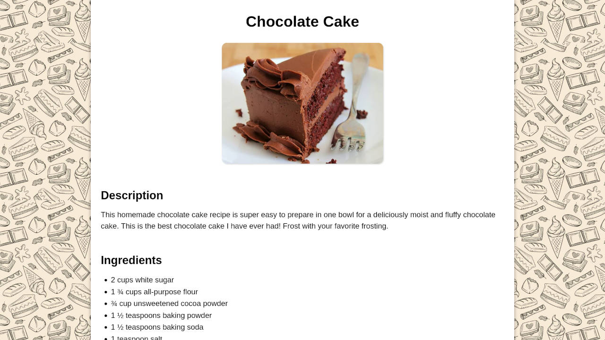

 

  

<h3 align="center">Odin Recipes | The Odin Project</h3>

  

     
     
    <a href="https://adrianogtl.github.io/top-odin-recipes/">View demo 👀</a>
    &nbsp;&nbsp;&nbsp;
    <a href="https://www.theodinproject.com/">The Odin Project 📚</a>

  

## 🎯 About

- This project is part of Foundations Course from The Odin Project
- Assignment: https://www.theodinproject.com/lessons/foundations-recipes#assignment

## ♥️ Acknowledgments

- Recepies and images from [All recipes](https://www.allrecipes.com/)
- Background pattern and icon from [Freepik](https://www.freepik.com)
